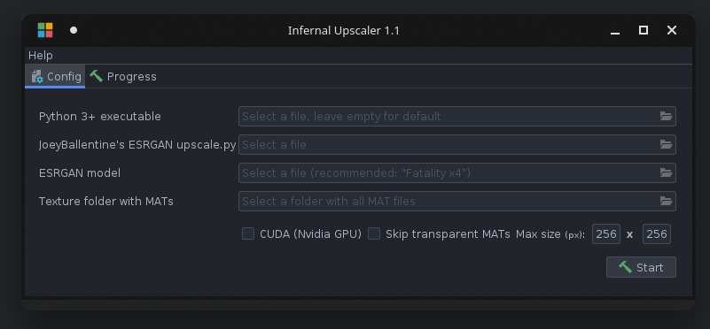
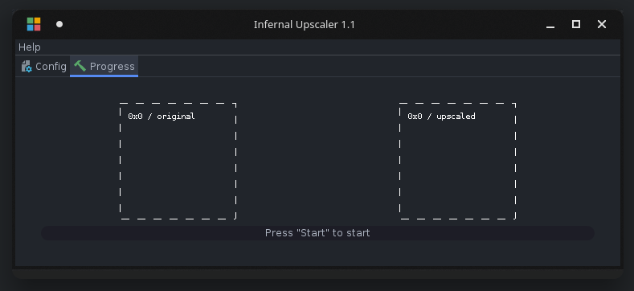

# Infernal Upscale

This tool was created to upscale MAT files using the ESRGAN algorithm for the game "Indiana Jones and the Infernal Machine".
First make sure you use the extracted version of the game (manual loading out of the "Resource" folder instead of GOB files.)
Then extract the MAT's of the level CND file.
Use this tool to upscale the MAT files and repack them into the CND (or use NDY).
Start the game and enjoy cool graphics!

   

## Copyright notice

This tool does not contain any copyrighted code, images or assets of the game. 
It was solely developed to showcase the possibilities of modding. I am not responsible for any misuse of this program.